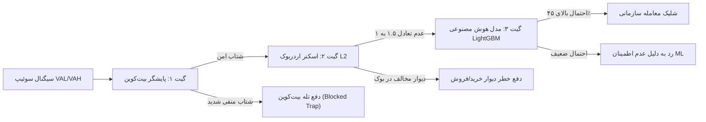

# 📘 کتابچه راهنما و پایگاه دانش استراتژی سازمانی MML AI
> **راهنمای جامع، روان و کاربردی تئوری حراج بازار (AMT)، اردر فلو و مدیریت سرمایه سازمانی برای تمام سطوح**

---

## 📑 فهرست مطالب
1. [مقدمه: چرا ۹۵٪ معامله‌گران آماتور حساب خود را خالی می‌کنند؟](#۱-مقدمه-چرا-۹۵-معاملهگران-آماتور-حساب-خود-را-خالی-میکنند)
2. [فصل اول: تئوری حراج بازار (AMT) به زبان فوق‌العاده ساده](#۲-فصل-اول-تئوری-حراج-بازار-amt-به-زبان-فوقالعاده-ساده)
3. [فصل دوم: ستاپ ورود و شکار سوئیپ نقدینگی (Liquidity Sweep)](#۳-فصل-دوم-ستاپ-ورود-و-شکار-سوئیپ-نقدینگی-liquidity-sweep)
4. [فصل سوم: حد ضرر ساختاری سوئیپ (Sweep Invalidation SL)](#۴-فصل-سوم-حد-ضرر-ساختاری-سوئیپ-sweep-invalidation-sl)
5. [فصل چهارم: فیلترهای سه‌گانه تایید ورود (Triple Confirmation Gates)](#۵-فصل-چهارم-فیلترهای-سهگانه-تایید-ورود-triple-confirmation-gates)
6. [فصل پنجم: مدیریت سرمایه، لوریج داینامیک و سقف ریسک ۳٪](#۶-فصل-پنجم-مدیریت-سرمایه-لوریج-داینامیک-و-سقف-ریسک-۳)
7. [فصل ششم: خروج چندپله‌ای و پوزیشن رانر (Multi-TP & Runner)](#۷-فصل-ششم-خروج-چندپلهای-و-پوزیشن-رانر-multi-tp--runner)
8. [فصل هفتم: معماری ارتباط پاین‌اسکریپت و سرور لایو](#۸-فصل-هفتم-معماری-ارتباط-پایناسکریپت-و-سرور-لایو)
9. [فصل هشتم: پرسش‌های متداول (FAQ) معامله‌گران تازه‌کار](#۹-فصل-هشتم-پرسشهای-متداول-faq-معاملهگران-تازهکار)
10. [واژه‌نامه اصطلاحات کلیدی (Cheat Sheet)](#۱۰-واژهنامه-اصطلاحات-کلیدی-cheat-sheet)

---

## ۱. مقدمه: چرا ۹۵٪ معامله‌گران آماتور حساب خود را خالی می‌کنند؟

بیشتر تریدرهای تازه‌کار ماه‌ها زمان خود را صرف پیدا کردن اندیکاتور جادویی (مثل تقاطع مووینگ اوریج‌ها، RSI بالای ۷۰ یا MACD) می‌کنند. اما واقعیت تلخ این است:
> **اندیکاتورهای تاخیری قیمت را حرکت نمی‌دهند؛ حراج عرضه و تقاضاست که قیمت را می‌سازد.**

بانک‌های وال‌استریت، صندوق‌های هج‌فاند و نهنگ‌های کریپتو هیچ‌گاه بر اساس کراس دو خط خرید و فروش نمی‌کنند. آن‌ها به دنبال پاسخ به دو سوال کلیدی هستند:
1. **کجا قیمت حراج منصفانه است و کجا گران‌فروشی یا تخفیف افراطی خورده است؟**
2. **کجا استاپ‌لاس‌های تریدرهای خرد جمع شده تا نقدینگی لازم برای پر شدن اردرهای سنگین آن‌ها فراهم شود؟**

سامانه **MML AI** دقیقاً بر همین منطق نهادی استوار است و به جای حدس و گمان، ریزساختار معاملات را رصد می‌کند.

---

## ۲. فصل اول: تئوری حراج بازار (AMT) به زبان فوق‌العاده ساده

تصور کنید وارد یک بازار بزرگ طلا یا میدان میوه و تره‌بار می‌شوید:
* اگر گوجه‌فرنگی در کل روز کیلویی **۵۰ هزار تومان** معامله شده باشد، این یعنی قیمت **منصفانه و مورد توافق** همگان است.
* اگر در پایان روز بارندگی شدید شود و قیمت به **۲۰ هزار تومان** سقوط کند، این یک **«حراج افراطی (تخفیف عالی)»** است و به محض ورود خریداران، قیمت فوراً به سمت ۵۰ هزار تومان پرواز می‌کند.
* اگر اول صبح بار کمیاب باشد و قیمت به **۸۰ هزار تومان** برسد، این **«گران‌فروشی»** است و به محض پایان هیجان، فروشندگان برای خالی کردن انبارها قیمت را دوباره به ۵۰ هزار تومان کاهش می‌دهند.

در چارت معاملات، ابزار **والیوم پروفایل واقعی (Volume Profile)** همین کار را برای ما انجام می‌دهد:

```
    [قیمت بسیار گران] ───► خارج از رنج (فرصت شورت پس از ریجکت)
         ▲
─────────┼─────────► سقف ارزش روز قبل (VAH: Value Area High)
         │
         │  ۷۰٪ حجم کل معاملات ۲۴ ساعت گذشته در این محدوده انجام شده است
         │
─────────●─────────► نقطه تعادل و آهنربای قیمت (POC: Point of Control)
         │
         │  محدوده ارزش عادلانه (Value Area)
         │
─────────┼─────────► کف ارزش روز قبل (VAL: Value Area Low)
         ▼
    [قیمت بسیار ارزان] ──► خارج از رنج (فرصت لانگ پس از بازگشت)
```

* **POC (نقطه تعادل / Point of Control):** قیمتی است که بیشترین حجم پول در آن تبادل شده است (خط زرد چارت). قیمت همیشه مثل یک آهنربا به سمت این خط کشیده می‌شود.
* **VAL (کف ارزش / Value Area Low):** کف قیمت محدوده حراج دیروز (خط سبز چارت).
* **VAH (سقف ارزش / Value Area High):** سقف قیمت محدوده حراج دیروز (خط قرمز چارت).

---

## ۳. فصل دوم: ستاپ ورود و شکار سوئیپ نقدینگی (Liquidity Sweep)

نهنگ‌ها اردرهای چند میلیون دلاری دارند. آن‌ها نمی‌توانند با یک کلیک ساده در قیمت دلخواه خرید کنند چون قیمت بلافاصله بالا می‌پرد و ضرر می‌کنند. آن‌ها به **«نقدینگی فروشندگان»** نیاز دارند.

### سناریوی شکار لانگ (VAL Sweep):
1. **تله انداختن:** قیمت عمداً به زیر کف ارزش روز قبل (VAL) هل داده می‌شود.
2. **شکار معامله‌گران آماتور:** تریدرهای خرد با دیدن شکست کف، وحشت‌زده شورت باز می‌کنند یا استاپ‌لاس پوزیشن‌های خرید قبلی فعال می‌شود (فروش اجباری).
3. **بلعیدن نقدینگی:** نهنگ‌ها تمام این سفارشات فروش ارزان را در کف قیمت می‌خرند.
4. **نشانه ورود ما:** کندل ۵ دقیقه‌ای با یک سایه بلند (Wick) زیر VAL تشکیل شده و **بدنه آن مجدداً بالای خط VAL بسته می‌شود**. این یعنی جذب کامل فروشندگان و زمان طلایی ورود به پوزیشن لانگ!

---

## ۴. فصل سوم: حد ضرر ساختاری سوئیپ (Sweep Invalidation SL)

آماتورها استاپ‌لاس خود را با درصدهای فرضی (مثلاً ۱٪ پایین‌تر) یا تقسیم‌های جبری می‌گذارند. بازار اهمیتی به درصدهای ریاضی فرضی شما نمی‌دهد!  
در سامانه MML AI، حد ضرر **ساختاری** است:

$$\text{Long SL} = \min(\text{Low}_{3\text{ bars}}) - (\text{ATR} \times 0.20)$$

* **چرا پایین‌ترین نوک ۳ کندل اخیر؟**  
  چون آن کف قیمت، نقطه‌ای بوده که نهنگ‌ها نقدینگی را جمع کرده‌اند. اگر قیمت دوباره به زیر آن نفوذ کند، یعنی فرضیه حراج باطل شده و دیگر دلیلی برای ماندن در پوزیشن وجود ندارد.
* **بافر ATR چیست؟**  
  یک فضای تنفس چند دلاری بر اساس نوسان طبیعی بازار تا نویزهای لحظه‌ای استاپ ما را فعال نکنند.

---

## ۵. فصل چهارم: فیلترهای سه‌گانه تایید ورود (Triple Confirmation Gates)

حتی اگر سوئیپ قیمت رخ دهد، سامانه تا ۳ تاییدیه امنیتی هم‌زمان نگیرد، ماشه معامله را نمی‌کشد:



### ۱. پایشگر بیت‌کوین (BTC Cross-Asset Watchdog)
بیت‌کوین لوکوموتیو کل بازار کریپتو است. اگر اتریوم بهترین ستاپ لانگ تاریخ را تشکیل داده باشد اما شتاب ۱۵ دقیقه‌ای بیت‌کوین منفی‌تر از **۰.۱۵- درصد** باشد، کل بازار تحت تاثیر دامپ بیت‌کوین غرق خواهد شد. سامانه فوراً معامله را وتو کرده و نوتیفیکیشن زرد **«دفع تله بیت‌کوین»** صادر می‌کند.

### ۲. اسکنر عمق اردربوک بایننس (Binance L2 Depth Scanner)
سرور در کسری از ثانیه ۵۰ سطح از سفارشات لیمیت صرافی بایننس را تا فاصله ۰.۳٪ قیمت اسکن می‌کند:
* **برای لانگ:** حجم سفارشات خرید (Bids) باید حداقل **۱.۵ برابر** سفارشات فروش (Asks) باشد (وجود ترامپولین حمایتی).
* **برای شورت:** اگر زیر قیمت یک دیوار خرید سنگین وجود داشته باشد، ورود به شورت مسدود می‌شود (**دفع خطر دیوار خرید**).

### ۳. مغز هوش مصنوعی (LightGBM Meta-Labeler)
یک مدل پیشرفته یادگیری ماشین که با دیتای ریزساختار ۱۰۰ روز گذشته آموزش دیده است، عواملی نظیر تیکر والیوم، RSI، دلتای تجمیعی و سرعت قیمت را می‌سنجد. معامله تنها در صورتی تایید می‌شود که احتمال ریاضی برد آن بالای **۴۵٪** باشد.

---

## ۶. فصل پنجم: مدیریت سرمایه، لوریج داینامیک و سقف ریسک ۳٪

آماتورها دائماً می‌پرسند: *«اهرم (Leverage) این استراتژی چنده؟»*  
پاسخ سیستم سازمانی این است: **اهرم متغیر است؛ ریسک دلاری ثابت است!**

در یک حساب ۱,۰۰۰ دلاری:
* سقف ریسک در هر معامله دقیقاً **۳٪ یعنی ۳۰ دلار** است.
* اگر فاصله استاپ‌لاس تا ورود کم باشد (مثلاً ۰.۵٪): سیستم اهرم را روی **6x** قرار می‌دهد.
* اگر فاصله استاپ دور باشد (مثلاً ۱.۵٪): سیستم اهرم را کاهش داده و روی **2x** می‌گذارد.

در هر دو حالت، اگر بدترین سناریو رخ دهد و استاپ شما بخورد، حساب شما دقیقاً همان ۳۰ دلار (۳٪) را از دست می‌دهد. **امکان لیکوئید شدن در این سیستم از نظر ریاضی صفر است.**

---

## ۷. فصل ششم: خروج چندپله‌ای و پوزیشن رانر (Multi-TP & Runner)

یکی از تلخ‌ترین تجربیات هر تریدر این است که پوزیشنی با ۵۰ دلار سود ناگهان برمی‌گردد و با ضرر بسته می‌شود! سیستم MML AI برای حل این مشکل یک فرآیند خروج بی‌نقص دارد:

```
[قیمت ورود: ۲۵۰۰ دلار] ──► ریسک فعال (-۳۰ دلار سقف ضرر)
         │
         ▼
[تارگت اول TP1: ۲۵۲۵ دلار (POC)] ──► ۵۰٪ حجم بسته می‌شود
         │                            ★ استاپ باقی پوزیشن به قیمت ورود (۲۵۰۰ دلار) منتقل شد!
         │                            ★ معامله از این لحظه به بعد ۱۰۰٪ ریسک‌فری است.
         ▼
[تارگت دوم TP2: ۲۵۶۰ دلار (VAH)] ──► ۳۰٪ دیگر پوزیشن با سود عالی بسته می‌شود.
         │
         ▼
[رانر آزاد Runner (۲۰٪ باقی‌مانده)] ──► بدون تارگت باز می‌ماند تا موج‌های تاریخی صعودی را شکار کند!
```

---

## ۸. فصل هفتم: معماری ارتباط پاین‌اسکریپت و سرور لایو

این سیستم از دو بال هماهنگ تشکیل شده است:
1. **TradingView (دیدبان چارت):** اندیکاتور `MML_AI_Volume_Profile_Indicator.pine` به صورت لحظه‌ای سطوح حجم واقعی روزانه و سوئیپ‌های کندلی را استخراج کرده و به محض بسته شدن کندل، پلود داینامیک را از طریق دستور `alert()` ارسال می‌کند.
2. **سرور کلود پایتون (موتور ارزیابی و اجرا):** سرور روی بستر ابری (Render) همیشه بیدار است، وب‌هوک را می‌گیرد، دفترچه L2 بایننس را اسکن می‌کند، خروجی مدل ML را می‌گیرد و در نهایت سفارشات پله‌ای را با کلیدهای API ارسال می‌نماید.

---

## ۹. فصل هشتم: پرسش‌های متداول (FAQ) معامله‌گران تازه‌کار

#### س: اگر اینترنت من قطع شود، معاملاتم در خطر می‌افتد؟
**پاسخ:** خیر! تمام منطق استاپ‌لاس و پایشگر بریک‌اون روی سرور ابری کلود (Render) و داخل صرافی بایننس اجرا می‌شود و قطعی کامپیوتر یا موبایل شما هیچ اثری روی معاملات ندارد.

#### س: آیا برای استفاده از این سیستم نیاز به اشتراک پولی تریدینگ‌ویو دارم؟
**پاسخ:** خیر، پاین‌اسکریپت به گونه‌ای بهینه‌سازی شده که روی اکانت‌های ۱۰۰٪ رایگان تریدینگ‌ویو با تایم‌فریم ۵ دقیقه بدون نقص کار می‌کند.

#### س: چرا بعضی روزها هیچ معامله‌ای انجام نمی‌شود؟
**پاسخ:** چون معامله‌گر حرفه‌ای هر روز معامله نمی‌کند! سیستم تنها زمانی شلیک می‌کند که قیمت در ارزان‌ترین کف (تخفیف ارزشی)، بدون خطر تله بیت‌کوین و با حضور دیوارهای سنگین خریداران باشد. صبر کردن بخشی از استراتژی برد است.

---

## ۱۰. واژه‌نامه اصطلاحات کلیدی (Cheat Sheet)

| اصطلاح | معادل انگلیسی | تعریف به زبان خودمانی |
| :--- | :--- | :--- |
| **تئوری حراج** | Auction Market Theory (AMT) | علمی که بازار را مانند یک حراجی کالا بر اساس تعادل عرضه و تقاضا می‌بیند. |
| **نقطه کنترل** | POC (Point of Control) | قیمتی که بیشترین معامله در طول روز در آن ثبت شده (آهنربای جذب قیمت). |
| **سوئیپ نقدینگی** | Liquidity Sweep | نفوذ موقت به زیر کف یا بالای سقف قیمت برای فعال کردن استاپ آماتورها و بازگشت سریع. |
| **اردربوک L2** | Level 2 Orderbook | تابلوی سفارشات ثبت‌شده خریداران و فروشندگان در صرافی بایننس تا ۵۰ سطح قیمت. |
| **جذب نقدینگی** | Absorption | زمانی که یک دیوار بزرگ خرید یا فروش مانع حرکت قیمت شده و تمام فشار بازار را در خود هضم می‌کند. |
| **ریسک‌فری / بریک‌اون** | Breakeven | انتقال حد ضرر دقیقاً به قیمت ورود؛ به گونه‌ای که حتی اگر قیمت سقوط کند، معامله‌گر ۱ ریال هم ضرر نمی‌کند. |
| **رانر** | Runner | بخشی از پوزیشن (۲۰٪) که برای سودهای بسیار بزرگ باز گذاشته می‌شود تا روندهای بزرگ صعودی یا نزولی را شکار کند. |

---
*تهیه شده توسط تیم توسعه هسته الگوریتمی MML AI Engine*  
*نسخه مستندات: 2.4 (سازمانی)*
